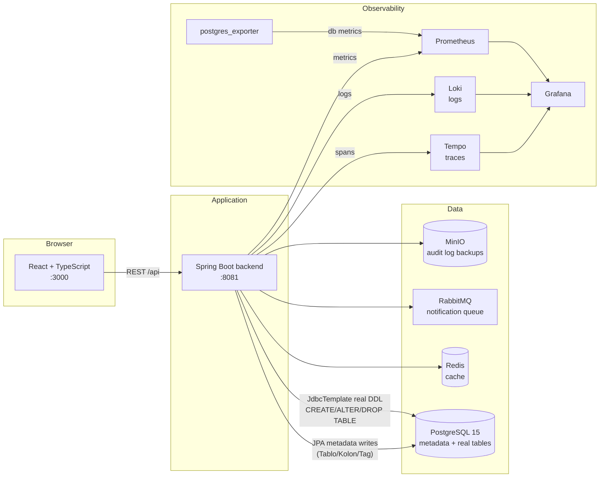
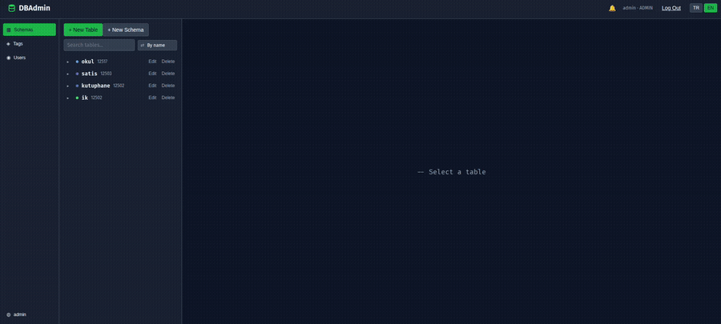

# DBAdmin

A small three-tier web application that lets a user manage a database through a UI —
create/rename/delete tables, add/remove columns, tag columns — without writing SQL by hand.

Every write (create table, add column, ...) does two things at once: it writes metadata rows
(`Tablo`/`Kolon`/`Tag`) **and** runs the real `CREATE`/`ALTER`/`DROP TABLE` statement, so the
metadata and the actual database schema always stay in sync.

## Stack

| Layer      | Tech                                              |
|------------|----------------------------------------------------|
| Database   | PostgreSQL 15                                      |
| Backend    | Spring Boot, Java 21, Spring Data JPA, Maven       |
| Frontend   | React + TypeScript                                 |
| Testing    | JUnit, Testcontainers (real Postgres, no mocks/H2) |
| Containers | Docker, Docker Compose                             |

## Architecture

The defining property of this app: **every write happens twice.** Creating a table (or
adding/renaming/deleting a column) writes metadata rows (`Tablo`/`Kolon`) through Hibernate *and*
runs the matching `CREATE`/`ALTER`/`DROP TABLE` against Postgres through a hand-built `JdbcTemplate`
executor, in the same `@Transactional` method. The two must never drift apart — see
[`CLAUDE.md`](./CLAUDE.md) for the consequences of that (SQL logging, injection surface,
non-transactional DDL).

Everything besides the db/backend/frontend trio is observability or infra plumbing added while
working through the assignment's stretch goals (indexing, N+1, async notifications, scheduled
reports, audit backups) — see [`DECISIONS.md`](./DECISIONS.md) for why each piece was added.



### Demo



## Prerequisites

- Docker & Docker Compose
- (Only if running services outside Docker) Java 21 + Maven, Node.js for the frontend

## Setup

1. Clone the repository:
   ```bash
   git clone https://github.com/Sayuba-1907/dbadmin.git
   cd dbadmin
   ```

2. Create a `.env` file in the project root (used by `docker-compose.yml`):
   ```env
   POSTGRES_DB=dbadmin_db
   POSTGRES_USER=postgres
   POSTGRES_PASSWORD=your_password_here
   DB_PORT=5433
   ```
   `.env` is gitignored — it holds the DB password, so it is never committed.

3. Start everything:
   ```bash
   docker compose up -d --build
   ```
   This is the only command needed — it brings up all six services, **including the frontend**
   (built by `frontend/Dockerfile` and served by nginx). `npm start` is not part of running the
   app; see "Running without Docker" below for when it is still useful.

   Naming services (`docker compose up -d db backend`) starts *only* those — a frequent reason
   for "the frontend didn't come up". After changing any source file, `--build` is required:
   both images bake their build output in (the backend's jar, the frontend's static files), so a
   plain restart silently serves the old build.

4. Open the app:
   - Frontend: http://localhost:3000
   - Backend API: http://localhost:8081/api
   - Postgres: `localhost:${DB_PORT}` (default `5433`, mapped so it doesn't collide with a local Postgres install on 5432)

5. Stop everything:
   ```bash
   docker compose down       # keeps data (named volume `pgdata`)
   docker compose down -v    # also wipes the database
   ```

## Running without Docker (local development)

These are development conveniences, not how the app is meant to be run — the deliverable is
`docker compose up -d --build` above.

- **Backend**: needs a Postgres instance reachable at the URL/credentials in
  `backend/src/main/resources/application.properties` (or via `SPRING_DATASOURCE_*` env vars),
  then from `backend/`: `./mvnw spring-boot:run`
- **Frontend**: from `frontend/`: `npm install && npm start` — CRA's dev server, worth using while
  writing UI code because of hot reload. It listens on the same port 3000 as the frontend
  container, so **stop one before starting the other** (`docker compose stop frontend`), otherwise
  the port is taken and the container fails to publish it.

  Note there is no dev-server proxy: `frontend/src/api/client.ts` calls `http://localhost:8081`
  directly and the backend allows that origin via CORS (`config/WebConfig.java`). Both the dev
  server and the nginx container reach the backend the same way — through the port published on
  the host, not over the compose network. Changing the backend port means changing both files.

## Running tests

```bash
cd backend
./mvnw test
```

Integration tests spin up a real PostgreSQL container via Testcontainers (Docker must be running).
Unit tests cover validation logic and column-type mapping; integration tests cover the
controller/service/DDL flow end to end, including asserting against `information_schema` that the
real table/columns were actually created — not just the metadata rows.

## API overview

All endpoints are under `/api`. Responses are DTOs, not JPA entities.

**Tables** (`/api/tablolar`)
| Method | Path                                  | Description                          |
|--------|----------------------------------------|--------------------------------------|
| GET    | `/api/tablolar`                        | List all tables                      |
| GET    | `/api/tablolar/{id}`                   | Get one table with its columns       |
| POST   | `/api/tablolar`                        | Create a table (name + columns)      |
| PATCH  | `/api/tablolar/{id}`                   | Rename a table                       |
| DELETE | `/api/tablolar/{id}`                   | Delete a table (cascades to columns) |
| POST   | `/api/tablolar/{id}/kolonlar`          | Add a column to a table              |
| DELETE | `/api/tablolar/{id}/kolonlar/{kolonId}`| Delete a column                      |
| PATCH  | `/api/tablolar/{id}/kolonlar/{kolonId}/name` | Rename a column                |
| PATCH  | `/api/tablolar/{id}/kolonlar/{kolonId}/tag`  | Change/clear a column's tag    |

**Tags** (`/api/tags`)
| Method | Path         | Description       |
|--------|--------------|--------------------|
| GET    | `/api/tags`  | List all tags      |
| POST   | `/api/tags`  | Create a tag       |

### Validation rules

Applied to both table and column names, enforced on the backend regardless of what the frontend
sends:
- Length: 2–30 characters
- Must not start with an uppercase letter
- Letters, digits and underscore only
- Duplicate name (within the relevant scope) → `409 Conflict`, not `400`

Column `type` must be one of `numeric` / `text` / `datetime` / `boolean` (`datetime` maps to
Postgres `timestamp`); it is fixed at creation and cannot be changed afterwards.

Validation failures and conflicts return a consistent JSON error body (status, error, message,
machine-readable `code`, and a `details` map) via a centralized `@RestControllerAdvice`. The
frontend shows these as colour-coded notifications (green/amber/red by HTTP status).

## Project structure

```
backend/    Spring Boot app (entity / repository / service / controller / dto / ddl / validation)
frontend/   React + TypeScript app (dashboard, table sidebar, column detail, i18n TR/EN)
DECISIONS.md   ADR-lite decision journal — what was chosen, what was ruled out, and why
docker-compose.yml   db + backend + frontend, one container each
```

See [`DECISIONS.md`](./DECISIONS.md) for the reasoning behind notable design choices.
